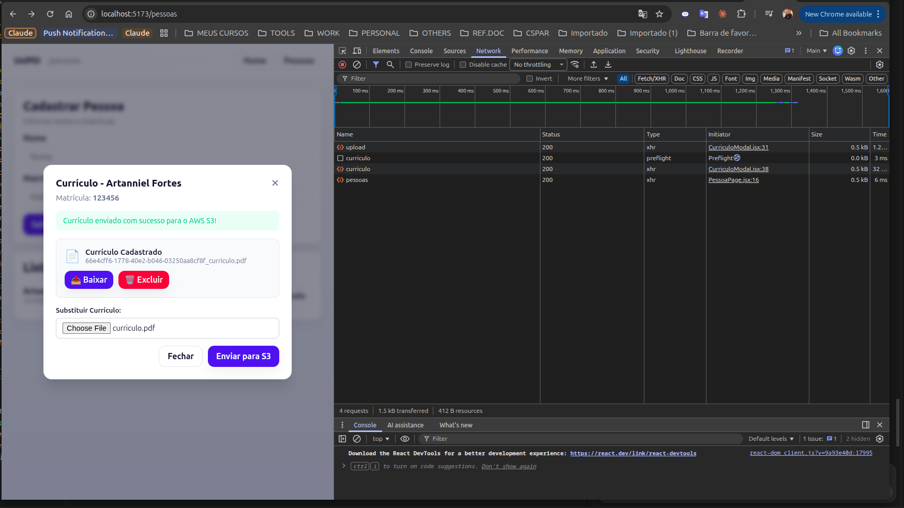
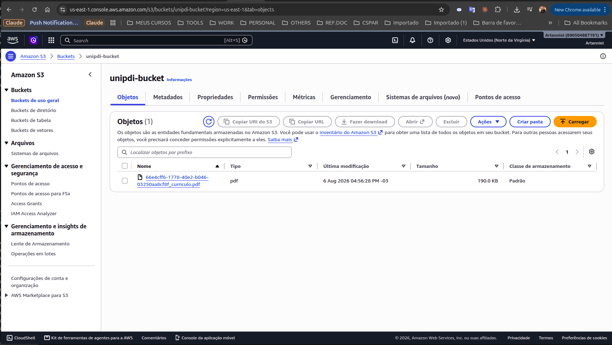

# UniPDI - Sistema de Plano de Desenvolvimento Individual

**UniPDI** é uma aplicação desenvolvida para que estudantes e profissionais possam cadastrar e gerenciar seus **Planos de Desenvolvimento Individual (PDI)** e **Currículos** de forma integrada aos serviços da AWS.  
Este projeto tem objetivo educacional e prático, abrangendo arquitetura de microserviços, integração com **AWS S3** para armazenamento de arquivos em nuvem, **Docker**, **Kubernetes** e **Cloud Computing**.

---

## 🏗️ **Arquitetura da Aplicação**

A aplicação é composta pelos seguintes componentes:

- **Backend**  
  - Linguagem: **Java 21**  
  - Framework: **Spring Boot 3.5.4** (com Spring Cloud AWS S3 Starter 3.3.0)  
  - Banco de Dados: **MongoDB** (gerenciamento de Pessoas, PDIs e Metas)  
  - Armazenamento em Nuvem: **AWS S3 / LocalStack** (armazenamento persistente de currículos em formato PDF, DOCX, Imagens)  
  - Responsável pelas APIs RESTful e integração de armazenamento.

- **Frontend**  
  - Framework: **React 19** com **Vite**  
  - Estilização: **CSS Modules & Global System**  
  - Biblioteca HTTP: **Axios**  
  - Interface moderna com suporte a cadastros, gestão de PDIs e Modal Interativo para Upload, Download e Exclusão de Currículos no S3.

---

## ☁️ **Recursos de Armazenamento na Nuvem (AWS S3)**

O sistema conta com suporte nativo ao **AWS S3** (ou **LocalStack** para desenvolvimento local) para a gestão de documentos de currículos associados a cada pessoa cadastrada.

### 🖼️ **Demonstração do Fluxo de Upload e Armazenamento**

#### 1. Interface Web - Modal de Gestão de Currículo
O modal interativo permite enviar novos arquivos para o S3, visualizar o status, baixar o arquivo armazenado ou excluí-lo diretamente.



#### 2. Armazenamento no AWS S3
Os arquivos enviados recebem uma chave única UUID para evitar colisões e são salvos diretamente no bucket configurado no S3.



---

## 🛠️ **Endpoints da API (Arquivos & S3)**

### **Gerenciamento Generico de Arquivos (`FileStorageController`)**
- `POST /api/files/upload`: Realiza o upload de um arquivo Multipart (`file`) para o bucket S3 e retorna a chave gerada (`fileKey`).
- `GET /api/files/download/{key}`: Realiza o streaming/download do arquivo armazenado no S3 através da chave.
- `DELETE /api/files/{key}`: Remove o objeto com a chave especificada do bucket S3.

### **Gerenciamento de Currículos vinculados à Pessoa (`PessoaController`)**
- `POST /pessoas/{matricula}/curriculo`: Envia o arquivo do currículo para o S3 e vincula a chave diretamente à pessoa.
- `PUT /pessoas/{matricula}/curriculo`: Associa uma `fileKey` existente ao cadastro da pessoa.
- `DELETE /pessoas/{matricula}/curriculo`: Remove o currículo do S3 e desvincula da pessoa.

---

## 📦 **Pré-requisitos**

Antes de iniciar, certifique-se de ter instalado:

- **Docker** e **Docker Compose**
- **Java 21** e **Maven**
- **Node.js (>=18)** e **npm**

---

## ▶️ **Como Executar o Projeto**

### 🚀 **Opção 1: Inicialização Automática com o Script (`start.sh`)** [Recomendado]

Criamos um script unificado que inicia o backend e frontend em paralelo com a checagem correta de dependências:

```bash
./start.sh
```

---

### 🧱 **Opção 2: Execução Passo a Passo**

#### **1. Subir os Serviços de Infraestrutura (MongoDB)**

```bash
docker-compose up -d
```

#### **2. Executar o Backend (Spring Boot)**

No diretório `unipdi-backend`:

```bash
mvn spring-boot:run
```

O backend estará ativo em: `http://localhost:8080`

#### **3. Executar o Frontend (React + Vite)**

No diretório `unipdi-frontend`:

```bash
npm install
npm run dev
```

O frontend estará ativo em: `http://localhost:5173`

---

## ⚙️ **Configuração de Variáveis de Ambiente (S3)**

As configurações do S3 ficam centralizadas no arquivo `application.properties` do backend e podem ser sobrescritas por variáveis de ambiente:

```properties
# Configuração AWS S3
spring.cloud.aws.region.static=${AWS_REGION:us-east-1}
spring.cloud.aws.credentials.access-key=${AWS_ACCESS_KEY_ID:test}
spring.cloud.aws.credentials.secret-key=${AWS_SECRET_ACCESS_KEY:test}
aws.s3.bucket-name=${AWS_S3_BUCKET_NAME:unipdi-bucket}

# Para testes locais com LocalStack (descomente se necessário):
# spring.cloud.aws.s3.endpoint=http://localhost:4566
```

---

## 🔗 **Fluxo de Acesso**

- **Frontend (Interface Web):** [http://localhost:5173](http://localhost:5173)  
- **Backend (Status & APIs):** [http://localhost:8080](http://localhost:8080)  
- **MongoDB:** `localhost:27017`

---

## 🎯 **Objetivo Educacional**

Este projeto abrange os seguintes tópicos de infraestrutura e cloud:

- **AWS Cloud / S3**: Armazenamento de objetos em nuvem com alta disponibilidade.
- **Docker**: Conteinerização da aplicação e dependências.
- **Docker Compose**: Orquestração de múltiplos serviços em ambiente de desenvolvimento.
- **Kubernetes**: Implantação e escalabilidade em cluster.

---

## 📜 **Créditos e Autoria**

- **Projeto Base & Concepção Original:**  
  Projeto idealizado e desenvolvido com base nas aulas e estrutura fornecida pela **Professora Jaqueline**, servindo como fundamento acadêmico e prático para o projeto da disciplina de Infraestrutura Cloud (Módulo 7 - UniPDI).

- **Contribuições & Extensões (Artanniel):**  
  - **Integração com AWS S3 / LocalStack:** Implementação completa da camada de persistência e gerenciamento de arquivos de currículos (upload, download, streaming e exclusão) via Amazon S3 no backend Spring Boot (`FileStorageController` e integração com `PessoaController`).
  - **Interface Web para Gestão de Currículos:** Criação do modal interativo no frontend React (Vite) com upload de arquivos, feedback visual e ações de download/remoção.
  - **Automação do Ambiente:** Criação do script unificado de inicialização (`start.sh`) para execução paralela de backend e frontend com verificação de dependências.
  - **Documentação Técnica e Evidências:** Elaboração da documentação detalhada dos fluxos de armazenamento em nuvem, endpoints da API e registro com capturas de tela.
