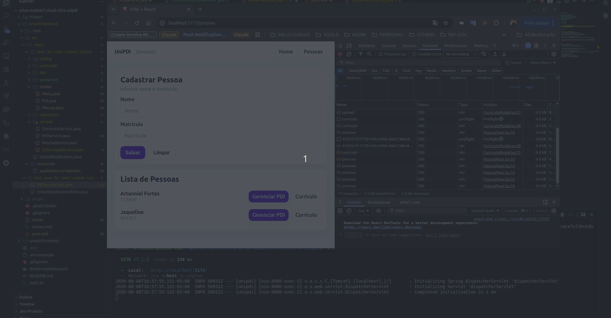
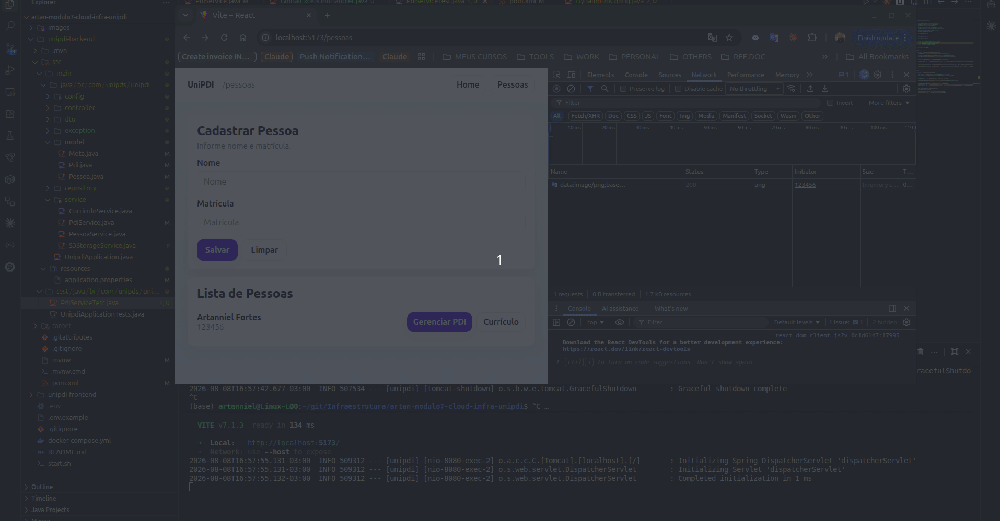

# UniPDI - Sistema de Plano de Desenvolvimento Individual

**UniPDI** é uma aplicação desenvolvida para que estudantes e profissionais possam cadastrar e gerenciar seus **Planos de Desenvolvimento Individual (PDI)**, **Metas** e **Currículos** de forma 100% integrada aos serviços em nuvem da **AWS (Amazon Web Services)**.  

Este projeto possui objetivo educacional e prático no âmbito de arquitetura de software, englobando microsserviços, integração com **AWS DynamoDB** (banco NoSQL), **AWS S3** (armazenamento de arquivos em nuvem), **Docker**, **Kubernetes** e **Cloud Computing**.

---

## 🏗️ **Arquitetura da Aplicação**

A aplicação foi migrada e modernizada para uma arquitetura serverless/cloud-native:

- **Backend**  
  - **Linguagem**: Java 21  
  - **Framework**: Spring Boot 3.5.4 (Spring Cloud AWS 3.3.0)  
  - **Banco de Dados NoSQL**: **AWS DynamoDB** (gerenciamento desacoplado de `Pessoa`, `Pdi` e `Meta` via DynamoDB Enhanced Client)  
  - **Armazenamento de Objetos**: **AWS S3** (armazenamento persistente de currículos em PDF, DOCX e Imagens)  
  - **Resiliência e Validação**: Tratamento global de exceções (`GlobalExceptionHandler`), resolvedor de nomes de tabela mantendo case-sensitivity (`DynamoDbTableNameResolver`) e inicializador automático de tabelas no DynamoDB.

- **Frontend**  
  - **Framework**: React 19 com Vite  
  - **Estilização**: CSS Modules & Design System Customizado  
  - **Comunicação HTTP**: Axios  
  - **Interface**: Dashboard moderno para gestão de PDIs, acompanhamento de metas e Modal Interativo para Upload, Download e Exclusão de Currículos no AWS S3.

---

## ☁️ **Integração Cloud AWS (DynamoDB & S3)**

O sistema opera de forma integrada com a nuvem da AWS:

1. **AWS DynamoDB**: Armazena as entidades do sistema (`Pessoa` e `Pdi` com metas aninhadas) em tabelas de alta performance (*Pay-Per-Request*).
2. **AWS S3**: Armazena os arquivos digitais de currículos associados aos usuários com chaves UUID únicas.

---

## 🖼️ **Demonstração Visual & Evidências no Console AWS**

### 1. Visualização do Painel do AWS DynamoDB & AWS S3
Demonstração em tempo real mostrando o cadastro, persistência e consulta de dados diretamente no **Painel do Console AWS DynamoDB** (tabelas `Pessoa` e `Pdi`), combinados ao upload e gestão de currículos em nuvem no **AWS S3**:



### 2. Comunicação e Integração no Painel AWS DynamoDB
Animação detalhada demonstrando a sincronização dos registros e requisições da aplicação com o **Painel do AWS DynamoDB** na nuvem da AWS:



### 3. Modal de Gestão de Currículo no Frontend
Interface Web interativa para upload de novos arquivos de currículo para o S3, acompanhamento de status e ações de download/exclusão:


### 4. Confirmação de Arquivos no Bucket AWS S3
Registro dos arquivos armazenados com identificadores únicos (UUID) no bucket do AWS S3:


---

## 🛠️ **Endpoints da API**

### 👤 **Gestão de Pessoas (`PessoaController`)**
- `POST /pessoas`: Cadastra uma nova pessoa no DynamoDB.
- `GET /pessoas`: Lista todas as pessoas cadastradas.
- `GET /pessoas/{matricula}`: Busca dados de uma pessoa pela matrícula.
- `POST /pessoas/{matricula}/curriculo`: Envia o arquivo do currículo para o S3 e vincula a chave à pessoa.
- `PUT /pessoas/{matricula}/curriculo`: Associa uma `fileKey` do S3 existente à pessoa.
- `DELETE /pessoas/{matricula}/curriculo`: Remove o currículo do S3 e desvincula da pessoa.

### 🎯 **Gestão de PDIs & Metas (`PdiController`)**
- `POST /pdis`: Cria um novo PDI associado a uma pessoa cadastrada.
- `GET /pdis/pessoa/{matricula}`: Lista todos os PDIs de uma pessoa específica.
- `POST /pdis/{id}/metas`: Adiciona uma nova meta ao PDI.
- `PATCH /pdis/{id}/metas/{metaId}`: Atualiza o status de conclusão de uma meta.

### 📁 **Armazenamento de Arquivos S3 (`FileStorageController`)**
- `POST /api/files/upload`: Upload genérico de arquivo Multipart (`file`) para o S3.
- `GET /api/files/download/{key}`: Download/Streaming do arquivo via chave S3.
- `DELETE /api/files/{key}`: Exclui o arquivo do bucket S3.

---

## 📦 **Pré-requisitos**

Para executar a aplicação localmente integrando com a AWS:

- **Java 21** e **Maven**
- **Node.js (>=18)** e **npm**
- **Credenciais AWS** (`AWS_ACCESS_KEY_ID`, `AWS_SECRET_ACCESS_KEY`, `AWS_REGION`) configuradas no arquivo `.env`

---

## ▶️ **Como Executar o Projeto**

### 🚀 **Inicialização Automática com o Script (`start.sh`)** [Recomendado]

O script unificado carrega as variáveis de ambiente do `.env`, verifica a presença das dependências e inicia o backend e o frontend simultaneamente:

```bash
./start.sh
```

---

### 🧱 **Execução Manual**

#### **1. Executar o Backend (Spring Boot)**

No diretório `unipdi-backend`:

```bash
mvn spring-boot:run
```

O backend estará ativo em: `http://localhost:8080`

> 💡 **Nota:** Na inicialização, a aplicação verifica automaticamente a existência das tabelas `Pessoa` e `Pdi` no AWS DynamoDB e as cria se necessário.

#### **2. Executar o Frontend (React + Vite)**

No diretório `unipdi-frontend`:

```bash
npm install
npm run dev
```

O frontend estará ativo em: `http://localhost:5173`

---

## ⚙️ **Configuração de Variáveis de Ambiente (.env)**

O arquivo `.env` na raiz do projeto centraliza as credenciais da AWS:

```env
AWS_REGION=us-east-1
AWS_ACCESS_KEY_ID=SUA_AWS_ACCESS_KEY_ID
AWS_SECRET_ACCESS_KEY=SEU_AWS_SECRET_ACCESS_KEY
AWS_S3_BUCKET_NAME=unipdi-bucket
```

---

## 🔗 **Links de Acesso Local**

- **Frontend (Interface Web):** [http://localhost:5173](http://localhost:5173)  
- **Backend (APIs & Status):** [http://localhost:8080](http://localhost:8080)  

---

## 📜 **Créditos e Autoria**

- **Projeto Base & Concepção Original:**  
  Projeto idealizado e desenvolvido com base nas aulas e estrutura fornecida pela **Professora Jaqueline**, servindo como fundamento acadêmico e prático para a disciplina de Infraestrutura Cloud (Módulo 7 - UniPDI).

- **Contribuições & Migração Cloud (Artanniel):**  
  - **Migração Completa para AWS DynamoDB:** Eliminação do MongoDB legado e transição completa para o AWS DynamoDB usando Spring Cloud AWS e DynamoDB Enhanced Client.
  - **Auto-Provisionamento de Tabelas DynamoDB:** Implementação de inicializador automático (`CommandLineRunner`) e resolvedor de nomes de tabela com suporte a maiúsculas/minúsculas.
  - **Integração com AWS S3:** Implementação completa da camada de gerenciamento de currículos em nuvem (upload, streaming, download e remoção) via Amazon S3.
  - **Tratamento Global de Erros:** Criação do `GlobalExceptionHandler` para validação amigável de regras de negócio e captura de erros do AWS SDK.
  - **Interface Web & UX:** Modal de currículos no React (Vite) e integração visual com o backend.
  - **Automação & Evidências Visuais:** Script `start.sh` de inicialização e documentação técnica detalhada com GIFs demonstrando as operações em tempo real no **Painel do Console AWS DynamoDB** e no **Bucket AWS S3**.
